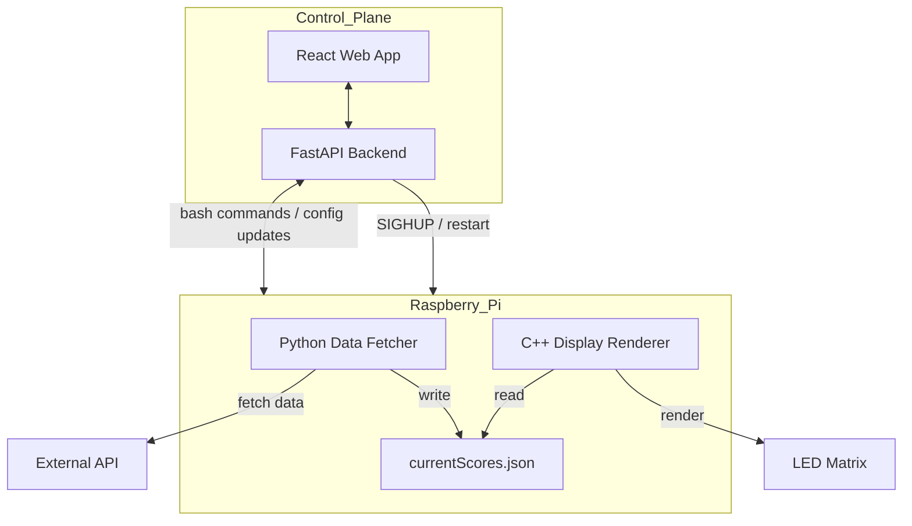
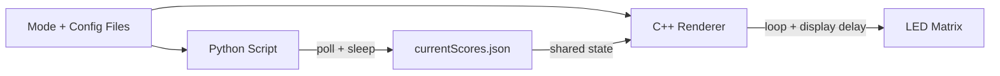

# RGB Matrix Display Board
A real-time display powered by a Raspberry Pi that translates data from external APIs into a formatted visualization on the matrix board.

## Author
Matthew Gray

GitHub: https://github.com/matgray007

Email: matt.r.g@outlook.com

LinkedIn: https://www.linkedin.com/in/mattgray7/

## Table of Contents
- [Overview](#overview)
- [Features](#features)
  - [Video Demo](#video-demo)
  - [APIs Used](#apis-used)
- [Disclaimer](#disclaimer)
- [Architecture](#architecture)
  - [Hardware Architecture](#hardware-architecture)
  - [Software Architecture](#software-architecture)
- [Setup Instructions](#setup-instructions)
  - [Hardware Setup](#hardware-setup)
  - [Software Setup](#software-setup)
  - [Running the Matrix](#running-the-matrix)
- [Configuration](#configuration)
- [Learnings](#learnings)
- [Future Improvements](#future-improvements)
- [License & Acknowledgements](#license--acknowledgements)
- [Dependencies](#dependencies)
- [Venv](#venv)
- [Retrieving Scores](#retrieving-scores)
- [Read Scores to LED Matrix](#read-scores-to-led-matrix)

---

## Overview
The RGB Matrix Display Board is a Raspberry Pi-powered system that renders real-time data from external APIs onto a low-resolution LED matrix. This project takes advantage of publicly-available APIs (namely ESPN and Spotify) to display live music, sports game scores, and other dynamic information in a format templated for the respective information

The system transform raw API JSON responses into compact visual elements ideal for an LED matrix (i.e. scrolling text, icons, etc.). A modular architecture allows for new external sources and display modes to be easily added with minimal changes required.

This project emphasizes real-time processing, hardware-software integration, and aesthetic but efficient display functionality.

## Features

This project has many different modes ranging in both fidelity and application scope. The matrix display scripts (matrix frontend) controls how the data retrieved is displayed. The data retrieval script (matrix backend) controls what is displayed. Both matrix frontend and backend have distinct modes that control their functionality. See the [Configuration](#configuration) section for setting/changing modes.

[#TODO: Add pictures of all of the different frontend modes]

### Frontend

As of 4/5/2026, the matrix display modes include the following:
-  Scoreboard
    - No Logos: Traditional scoreboard with text team names
    - Small Logos: Built upon the No Logos but with team logos replacing the textual names
    - Large Logos: Team logos take up a majority of the screen but are unobtrusive to game information
- Spotify Currently Playing: Displays the current song's album cover with scrolling song name and artist name(s)
- Clock: Current time (based on Raspberry Pi's current time) with ambient background

### Backend

The matrix backend script allows for some additional constraints within the above display modes
- Scoreboard
    - Live and Final: Retrieves all games today that are live or finished
    - Live Only: Filters out games that are not currently live
    - Favorite team only: Filters out all games that do not have the favorite team playing
    - Leagues: For each of the above, the league type must be selected to display games from that league. The leagues include:
        - NFL: National Football League
        - NBA: National Basketball Association
        - NCAAB: National Collegiate Athletic Association Men's Basketball

### Web App

In addition to the matrix frontend and backend, a simple React web app with Fast API backend was created for configuration management and general Raspberry Pi control. This was created to eliminate the need to ssh into the Pi for general matrix use.

### Video Demo
[#TODO: Add video demo cycling through the different modes]

### APIs Used

This project uses the rpi-rgb-led-matrix library by Henner Zeller,  
licensed under the GNU General Public License v2.0 (or later).

See: http://www.gnu.org/licenses/gpl-2.0.txt

All modifications and usage in this project comply with the terms of the GPL license.

This project uses data from Spotify and ESPN APIs but is not affiliated with, endorsed by, or sponsored by Spotify or ESPN.

---
Henner Zeller's rpi-rgb-led-matrix library can be accessed [here](https://github.com/hzeller/rpi-rgb-led-matrix).

ESPN does not maintain official documentation for their public API. A GitHub repository outlining the available endpoints can be accessed [here](https://gist.github.com/akeaswaran/b48b02f1c94f873c6655e7129910fc3b).

For the Spotify functionality, Spotify for Developers was used. Their Web API documentation can be viewed [here](https://developer.spotify.com/documentation/web-api)

## Architecture

### Hardware Architecture

### Software Architecture

#### General Workflow

#### Data Flow

The data flow diagram is included to give a more explicit display of how the runtime functionality works.

## Setup Instructions

### Hardware Setup

### Software Setup

### Running the Matrix

## Configuration

## Learnings

## Future Improvements

## License & Acknowledgements

## Dependencies
`sudo apt-get install libjsoncpp-dev`  
`sudo apt install libcurl4-openssl-dev`

## Creating the virtual environment
`python3 -m venv .venv`  
`source .venv/bin/activate`  
`pip3 install requests`

## Retrieving Scores
`python3 getScores.py`

## Read Scores to LED Matrix
`git submodule update --init --recusive`  
`cd matrix`  
`make -C lib`  
`cd ..`  
`make`  
`./sendScores.exe`