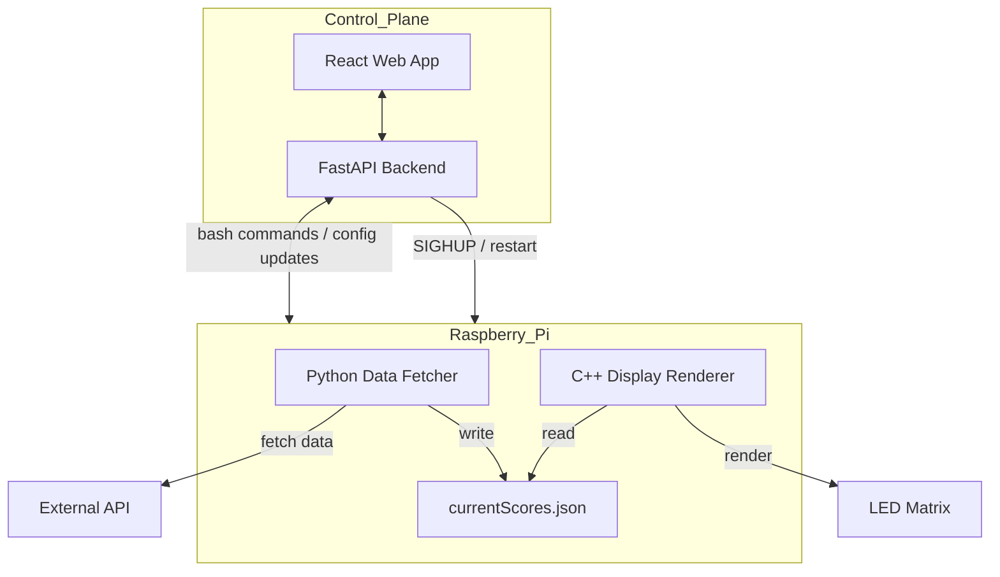
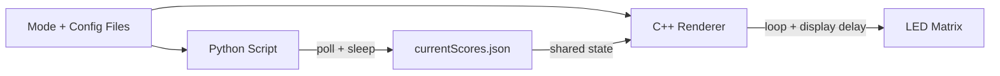

# RGB Matrix Display Board
A real-time display powered by a Raspberry Pi that translates data from external APIs into a formatted visualization on the matrix board.

## Author
Matthew Gray

GitHub: https://github.com/matgray007

Email: matt.r.g@outlook.com

LinkedIn: https://www.linkedin.com/in/mattgray7/

## Table of Contents
- [Overview](#overview)
- [Features](#features)
  - [Frontend](#frontend)
  - [Backend](#backend)
  - [Web App](#web-app)
  - [Video Demo](#video-demo)
  - [APIs Used](#apis-used)
- [Architecture](#architecture)
  - [Hardware Architecture](#hardware-architecture)
  - [Software Architecture](#software-architecture)
- [Setup Instructions](#setup-instructions)
  - [Hardware Setup](#hardware-setup)
  - [Software Setup](#software-setup)
  - [Running the Matrix](#running-the-matrix)
- [Configuration](#configuration)
- [Learnings](#learnings)
- [Future Improvements](#future-improvements)

---

## Overview
The RGB Matrix Display Board is a Raspberry Pi-powered system that renders real-time data from external APIs onto a low-resolution LED matrix. This project takes advantage of publicly-available APIs (namely ESPN and Spotify) to display live music, sports game scores, and other dynamic information in a format templated for the respective information

The system transform raw API JSON responses into compact visual elements ideal for an LED matrix (i.e. scrolling text, icons, etc.). A modular architecture allows for new external sources and display modes to be easily added with minimal changes required.

This project emphasizes real-time processing, hardware-software integration, and aesthetic but efficient display functionality.

## Features

This project has many different modes ranging in both fidelity and application scope. The matrix display scripts (matrix frontend) controls how the data retrieved is displayed. The data retrieval script (matrix backend) controls what is displayed. Both matrix frontend and backend have distinct modes that control their functionality. See the [Configuration](#configuration) section for setting/changing modes.

[#TODO: Add pictures of all of the different frontend modes]

### Frontend

As of 4/5/2026, the matrix display modes include the following:
-  Scoreboard: Displays live and final sports scores from the current day.
- Spotify Currently Playing: Displays the current song's album cover with scrolling song name and artist name(s)
- Clock: Current time (based on Raspberry Pi's current time) with ambient background

### Backend

The matrix backend script allows for some additional constraints within the above display modes
- Scoreboard
    - Live and Final: Retrieves all games today that are live or finished
    - Live Only: Filters out games that are not currently live
    - Favorite team only: Filters out all games that do not have the favorite team playing
    - Leagues: For each of the above, the league type must be selected to display games from that league. The leagues include:
        - NFL: National Football League
        - NBA: National Basketball Association
        - NCAAB: National Collegiate Athletic Association Men's Basketball

### Web App

In addition to the matrix frontend and backend, a simple React web app with Fast API backend was created for configuration management and general Raspberry Pi control. This was created to eliminate the need to ssh into the Pi for general matrix use.

[#TODO: Add picture of the webpage]

### Video Demo
[#TODO: Add video demo cycling through the different modes]

### APIs Used

This project uses the rpi-rgb-led-matrix library by Henner Zeller,  
licensed under the GNU General Public License v2.0 (or later).

See: http://www.gnu.org/licenses/gpl-2.0.txt

All modifications and usage in this project comply with the terms of the GPL license.

This project uses data from Spotify and ESPN APIs but is not affiliated with, endorsed by, or sponsored by Spotify or ESPN.

---
Henner Zeller's rpi-rgb-led-matrix library can be accessed [here](https://github.com/hzeller/rpi-rgb-led-matrix).

ESPN does not maintain official documentation for their public API. A GitHub repository outlining the available endpoints can be accessed [here](https://gist.github.com/akeaswaran/b48b02f1c94f873c6655e7129910fc3b).

For the Spotify functionality, Spotify for Developers was used. Their Web API documentation can be viewed [here](https://developer.spotify.com/documentation/web-api)

## Architecture

### Hardware Architecture

The hardware used for setup of this project includes:

- Raspberry Pi 4 Model B with power supply
- [64x32 RGB LED Matrix](https://www.adafruit.com/product/2278?srsltid=AfmBOoojB0MHMiDCVwrGxwuXMxjh9mwOA3fRDIbY4-guGwiUdotE89o-)
- [RGB Matrix Bonnet for Raspberry Pi](https://www.adafruit.com/product/3211?srsltid=AfmBOooZFZea9TqcYhKiVhNOVhHUmpka0WX1viSn1NGUvAPfMHScY6NS)
- [Socket Riser Headers](https://www.adafruit.com/product/4079?srsltid=AfmBOoq-9Pl8re24S9C_WstJWneUwBN8Y2hODJGWKcyMhp-Skhn0-d8b) (optional, but recommended)
- [5V 4A Power Supply](https://www.adafruit.com/product/1466)
- [3D Printed Stand](https://learn.adafruit.com/stream-deck-controlled-rgb-message-panel-using-adafruit-io/3d-printing)

The Raspberry Pi is capable of powering the matrix under light load on its own, but performance issues are likely if running without the second power supply for the bonnet. Most likely, the reds will display but the greens and blues will not.

### Software Architecture

#### General Workflow

#### Data Flow

The data flow diagram is included to give more detail on how the runtime functionality works. The sleep after polling is included to ensure requests fall within the external APIs' rates.

## Setup Instructions

### Hardware Setup

Please view [these wiring guidelines](matrix/wiring.md) for wiring concerns not covered in this section. This section will only go over wiring for setup with the above hardware.

[#TODO: Add wiring images]

### Software Setup

This system has been tested on [#TODO: Add the linux version]. It should be Linux-agnostic, however it has not been tested on other versions. Python 3.[#TODO: add python version] and pip 3.[#TODO: add pip version]. 

Cloning and compiling of the Zeller matrix API:

`git submodule update --init --recusive`  
`cd matrix`  
`make -C lib`  

#### Dependencies
Dependencies can be viewed in [this file](.dependencies).

[#TODO: finish the dependencies for the website too]

### Running the Matrix

Once the necessary dependencies have been installed and both repos have been cloned (this one and Zeller's rpi-rgb-led-matrix library), I would recommend running one of Zeller's demos as a sanity check. These demos can be viewed [here](matrix/examples-api-use/README.md). The matrix frontend code can be compiled by running `make frontend/sendScores.cc` [#TODO: Double check that this works or maybe we need to navigate to there]. Once it has finished compiling, the executable can be run with a variety of flags. A majority of these flags are hardware-specific, so vary as needed.

| Flag | Meaning | Values Used with Above Hardware |
| -------- | -------- | -------- |
| --led-rows=# | The number of rows available on the LED board | 32 |
| --led-cols=# | The number of columns available on the LED board | 64 |
| --led-limit-refresh=# | Rate at which the board will update. 0 means no limits. Defaulted to 0. | 60 |
| --led-slowdown-gpio=# | Needed for faster pis to ensure accurate speed. Might need to play with this number. | 2 |
| --led-gpio-mapping=[string] | The name of the GPIO mapping used. | adafruit-hat |
| -d [string] | The mode that the matrix will display in. | This value varies. See the [table below](#configuration) for available options. |
| -o | Favorite team only. | No value provided |

A [mode.json.copy](mode.json.copy) and a [config.json.copy](config.json.copy) have been included for your convenience. Copy the contents into mode.json and config.json respectively and alter as needed.

### Running the website

## Configuration

 ### Matrix Frontend

 The matrix frontend utilizes multiple method for controlling the configuration. The mode.json and config.json files are initially read to retrieve the mode it is to run in and then any additional configurations, respectively. However, while running the matrix frontend from the command line, any flags passed in will override what the executable reads from the files. The various modes are outlined here:

 | Flag | Meaning | Values Used with Above Hardware |
| -------- | -------- | -------- |

[#TODO: Make this a nice table]
- (scoreboard) No Logos: Traditional scoreboard with text team names
- (logos) Small Logos: Built upon the No Logos but with team logos replacing the textual names
- (large-logos) Large Logos: Team logos take up a majority of the screen but are unobtrusive to game information

## Learnings

## Future Improvements

This project has infinite possible depth and breadth. I hope to explore both of these directions as much as possible. The changes and additions most likely to occur next are improvements to what already exist before expanding in new directions. Here is a nowhere near comprehensive list of improvements:

- Restructure/rename folders
    - the Zeller repo should be in a better named folder
- Webpage styling
- Ability to toggle live only on the webpage [#TODO: This might be done already]
- Ability to toggle favorite only on the webpage
- "No songs being played currently"
- "No games today/currently"
    - I believe this exists, but it is being cut off currently.
- Togglable icon-from-url functionality 
    - Currently, the matrix frontend tries to retrieve the icon from the logos directory. If the logo is not present, then it fetches the logo from the url present in the API response.
- Sports news
    - Scrolls the news across the board and displays the associated team's logo
- Favorite team-animations
    - Namely touchdowns, field goals, sacks, etc.
    - Some example API responses for an NFL game are present in [this](ESPNResponses/) directory.
- NFL position on field
    - A thin line 10/12 pixels long that is white(?) up to where the team with the ball currently is
    - Maybe turns red while in the redzone?

-Make webpage look nice
-"No games today/currently"
-liveonly toggle on webpage
-"No songs being played currently"
-Shutdown pi api
-Make all sports use the url in the response instead of getting the logo from the repo. Leave original functionality as an option